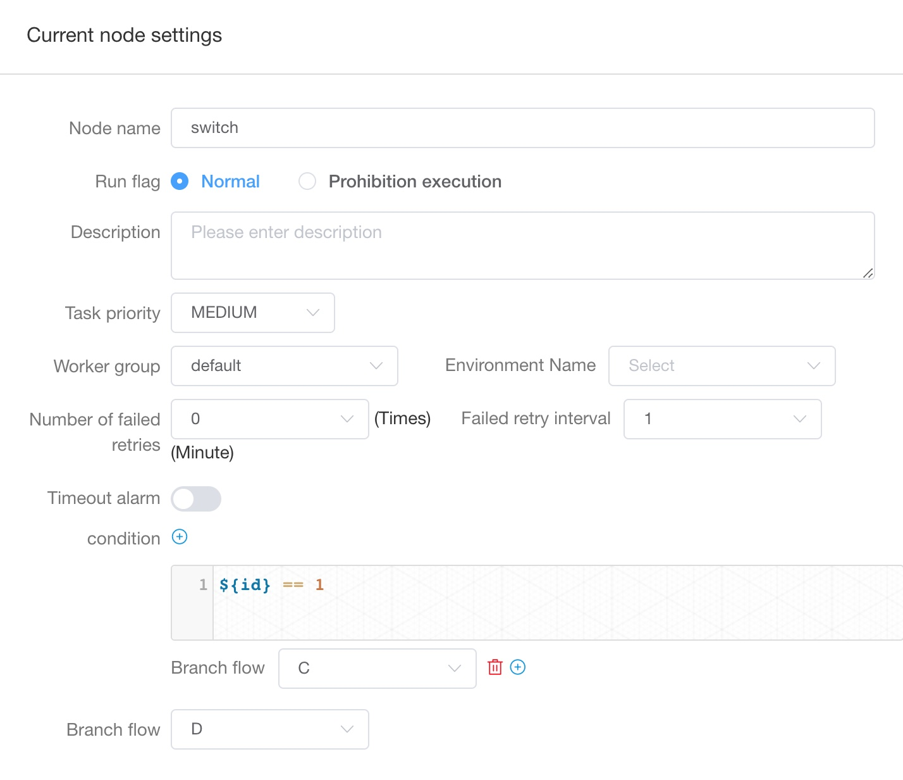

# Switch

Switch is a conditional judgment node, which branch should be executes according to the value of [global variable](../parameter/global.md) and the expression result written by the user.

## Create

Drag the  in the tool bar to create task. **Note** After the switch task is created, you must configure it downstream to make parameter `Branch flow` work.

## Parameter

- Node name: The node name in a workflow definition is unique.
- Run flag: Identifies whether this node can be scheduled normally, if it does not need to be executed, you can turn on the prohibition switch.
- Descriptive information: describe the function of the node.
- Task priority: When the number of worker threads is insufficient, they are executed in order from high to low, and when the priority is the same, they are executed according to the first-in first-out principle.
- Worker grouping: Tasks are assigned to the machines of the worker group to execute. If Default is selected, a worker machine will be randomly selected for execution.
- Number of failed retry attempts: The number of times the task failed to be resubmitted. It supports drop-down and hand-filling.
- Failed retry interval: The time interval for resubmitting the task after a failed task. It supports drop-down and hand-filling.
- Timeout alarm: Check the timeout alarm and timeout failure. When the task exceeds the "timeout period", an alarm email will be sent and the task execution will fail.
- condition: You can configure multiple conditions for the switch task. When the conditions are true, the configured branch will be executed. You can configure multiple different conditions to satisfy different businesses.
- Branch flow: The default branch flow, when all the conditions are false, it will execute this branch flow.

## Detail

Here we have three tasks, the dependencies are `A -> B -> [C, D]`, and task_a is a shell task and task_b is a switch task

- In task A, a global variable named `id` is defined through [global variable](../parameter/global.md), and the declaration method is `${setValue(id=1)}`
- Task B adds conditions and uses global variables declared upstream to achieve conditional judgment (note that global variables must exist when the switch is running, which means that switch task can use global variables that are not directly upstream). We want workflow execute task C when id = 1 else run task D
  - Configure task C to run when the global variable `id=1`. Then edit `${id} == 1` in the condition of task B, select `C` as branch flow
  - For other tasks, select `D` as branch flow

Switch task configuration is as follows

## Related Task

[condition](conditions.md)：[Condition](conditions.md)task mainly executes the corresponding branch based on the execution status (success, failure) of the upstream node. The [Switch](switch.md) task mainly executes the corresponding branch based on the value of the [global parameter](../parameter/global.md) and the judgment expression result written by the user.